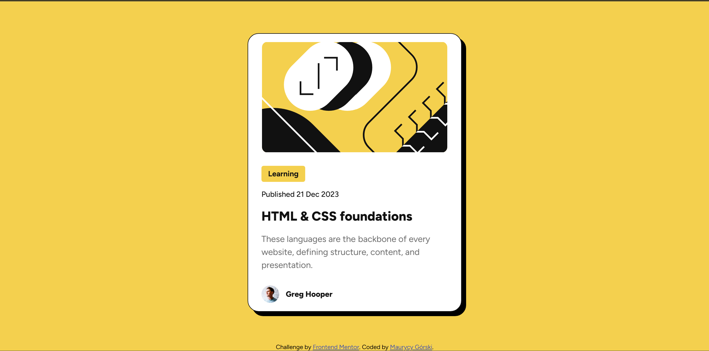

# Frontend Mentor - Blog preview card solution

This is a solution to the [Blog preview card challenge on Frontend Mentor](https://www.frontendmentor.io/challenges/blog-preview-card-ckPaj01IcS). Frontend Mentor challenges help you improve your coding skills by building realistic projects. 

## Table of contents

- [Overview](#overview)
  - [The challenge](#the-challenge)
  - [Screenshot](#screenshot)
  - [Links](#links)
- [My process](#my-process)
  - [Built with](#built-with)
  - [What I learned](#what-i-learned)
  - [Continued development](#continued-development)
- [Author](#author)

## Overview

### The challenge

Users should be able to:

- See hover and focus states for all interactive elements on the page

### Screenshot



### Links

- Solution URL: (https://your-solution-url.com)
- Live Site URL: (https://jvk321.github.io/Blog_preview_card/)

## My process

- First, I built the page with HTML elements. Then I styled the components with CSS properties untill the blog card looked like the solution. 

### Built with

- Semantic HTML5 markup
- CSS
- Flexbox

### What I learned

- Learned how to use @font-face
```css
@font-face {
    font-family: "Figtree";
    src: 
        url(assets/fonts/Figtree-VariableFont_wght.ttf);
        font-weight: 300 900;
        font-style: normal;
}
```
- Learned how to use filter to add a shadow like effect
```css
.blog-card {
    filter: drop-shadow(8px 8px #111111);
}
```
- Learned how to use the clamp function to scale font size

```css
.tag {
    font-size: clamp(12px, calc(11.3px + 0.19vw), 14px);
}
```
- Learned how to use the css pseudo-class :hover
```css
.title:hover{
    color: #F4D04E;
}
```
- Learned how to add a pointer while hovered above a element
```css
.title {
    cursor: pointer;
}
```

### Continued development

- Learn how to make the page more responsive on smaller screens. 

## Author

- Frontend Mentor - [@Jvk321](https://www.frontendmentor.io/profile/Jvk321)